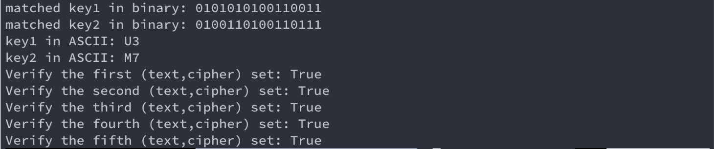

# Meet in the Middle Attack on Mini-AES using Python and SageMath

### Description
```
Description.pdf
```

### Instruction (Linux or MacOs environment):
```
sage hw4.sage
```




### Answer: 
```
The first key, k1
binary: 0101010100110011
ASCII: U3
```

```
The second key, k2
binary: 0100110100110111
ASCII: M7
```


### Explanations:

- **function decrypt()** <br />
First decrypt the keys by inputing one of the (text,cipher) set. <br />
After getting the two keys, save them to variable *k1* and *k2*.

- **function verify()** <br />
Check if the values of **encrypting *text* with *k1*** and **decrypting *cipher* with *k2*** are equal.
